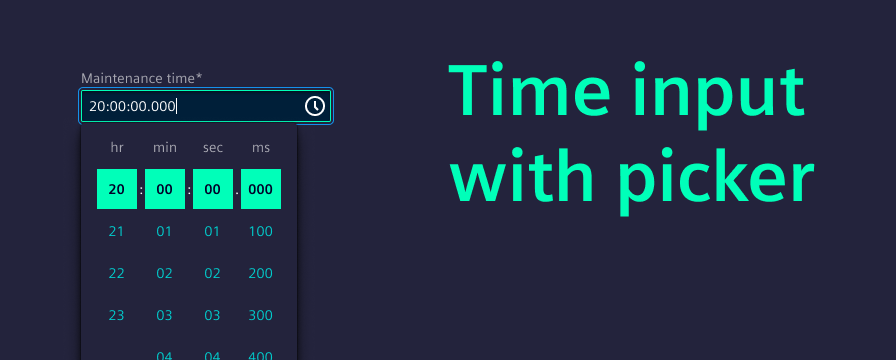
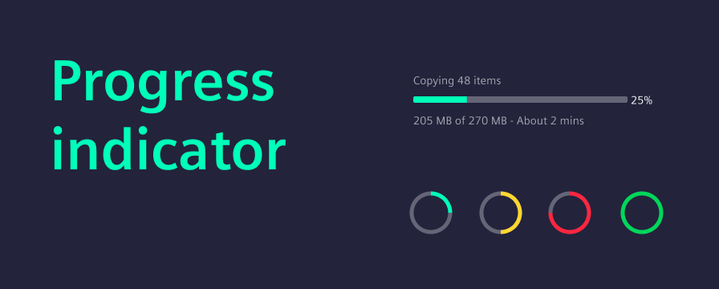
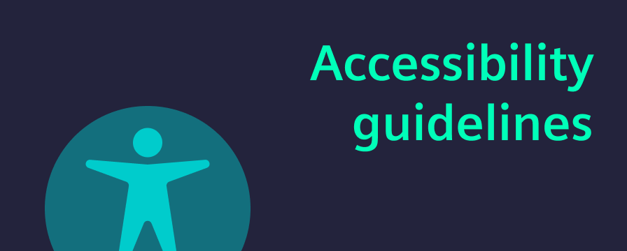
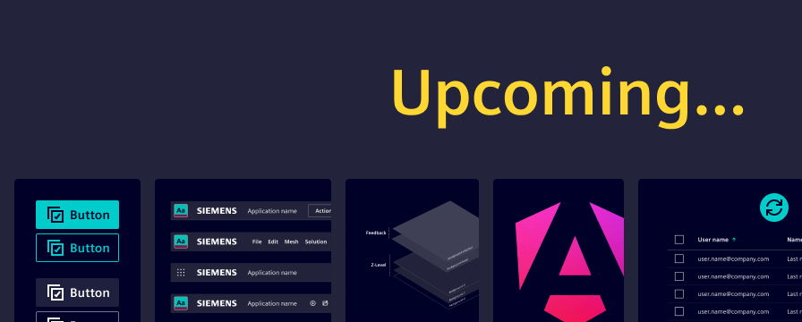

# Release V3.2.0

Over the past few months, we've been hard at work delivering new features, usability improvements, and important bug fixes. In this post, we’ll walk you through the highlights of our recent 3.1.0 and 3.2.0 minor releases.

We’ll also give you a sneak peek at what’s coming in the upcoming 4.0 major release.

<!-- truncate -->

# How to start?

- Install `@siemens/ix` (`@siemens/ix-angular`, `@siemens/ix-react`, `@siemens/ix-vue`) via the `latest` tag
- Review detailed changelog [here](/docs/home/migration/3_0_0/)
- Make sure you're using the latest published version of our Figma library

# Time input and redesigned time picker

The redesigned time picker introduces a smoother, more intuitive experience with scrollable values and one-click selection for hours, minutes, seconds, and milliseconds. This makes it easier and faster for users to select precise times, especially on touch devices. Learn more in the [usage guide](/docs/components/time-picker/guide).

Built on top of the new time picker, the new **time input** component is fully form-ready and integrates seamlessly with our form infrastructure described in the [forms field section](/docs/components/forms-field/guide). It supports validation, accesibility, and consistent styling. 

Learn more in the [usage guide](/docs/components/input-time/guide).

# Progress indicator

A long-awaited feature, the progress indicator is now available in both linear and circular variants. The linear variant is designed for horizontal layouts or when the progress value should be more visible. The circular variant is more suitable for compact or centered layouts, e.g. when it's replacing an icon.

Whether you're tracking file uploads, form completion, or background tasks, these indicators provide clear, accessible feedback to users. They’re fully customizable and easy to integrate. 

Learn more in the [usage guide](/docs/components/progress-indicator/code).

# Improved initial render performance

We’ve significantly improved the initial render performance by optimizing how components are initialized and rendered with StencilJS. 

Users will notice faster load times and smoother interactions, particularly in data-heavy applications, especially in complex environments like AG Grid.

# Enhanced icon toggle button

The icon toggle button has a new oval attribute, allowing its shape to be adjusted from square to oval. This provides greater flexibility in aligning with different design aesthetics and layout needs.

Toggle buttons are ideal for switching between states or modes. They’re commonly used in scenarios where a setting can be turned on or off independently.

Learn more in the [usage guide](/docs/components/toggle-button/guide).

# Theme generator

Our updated theme generator produces smaller, more efficient CSS variable files. It also supports cross-platform theming, making it easier to apply your design system consistently across web, mobile, and desktop applications. This update simplifies customization while improving performance.

# Accessibility

We’ve expanded our accessibility support with:

- Extended [WCAG guidelines](/docs/guidelines/accessibility/overview) tailored to our components
- Component-level accessibility checklists in Figma
- ARIA label support for our components

These improvements help teams build inclusive, accessible experiences more easily and confidently.

# Upcoming 4.0 major release

The upcoming 4.0 major release will introduce several impactful changes and enhancements across the design system and component libraries:

- **Button rework:** We’re refining the button component with:
    - Updated naming conventions for clarity
    - Rounded corners for Siemens brand consistency
    - A new icon-right option for better layout flexibility

- **App header enhancements:** The app header will become more customizable with an additional slot option for providing custom content.

- **Elevation principle simplification:** We’re streamlining the elevation system to make it easier to apply and understand visual hierarchy across components.

- **Angular 20 support:** Full compatibility with Angular 20, ensuring your projects stay up-to-date with the latest framework improvements.

- **AG Grid update:** We’re aligning with the latest AG Grid version to ensure seamless integration and improved performance.

Please reach out to us at [team.ix.industry@siemens.com](mailto:team.ix.industry@siemens.com) and tell us about your migration experience.
If you encounter any issues, we are here to support you every step of the way.

We greatly appreciate your contributions.
