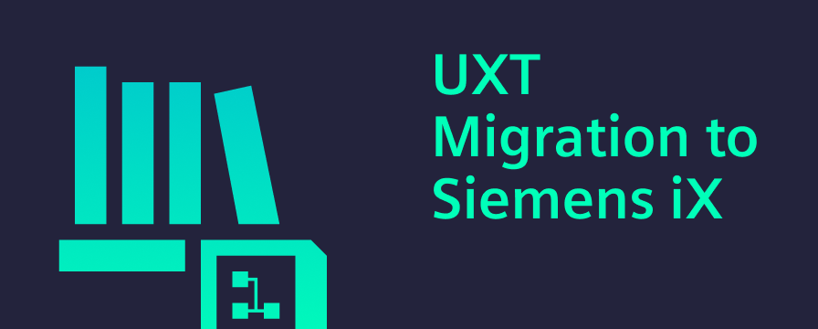

---
authors:
  - kathrinschalber
tags:
  - merging
---

import React from "react";
import { IxIcon } from "@siemens/ix-react";
import { iconReplace, iconSupport } from "@siemens/ix-icons/icons";
import {Card, CardList} from '@site/src/components/Card';
import '../../docs/home/card-with-icon.css';

# UXT Migration to Siemens Industrial Experience

As part of our journey, we proudly announce the integration of User Experience Toolkit (UXT) into Siemens Industrial Experience (iX). This strategic move consolidates our design resources and provides you with a more comprehensive, modern, and efficient solution.

<CardList>
 <Card link="home/migration/uxt"><IxIcon className="Card_Icon" name={iconReplace} size="16"></IxIcon> Migrate from UXT to iX</Card>
 <Card link="home/support/contact-us"><IxIcon className="Card_Icon" name={iconSupport} size="16"></IxIcon>Get support</Card>
</CardList>

<!-- truncate -->

# How to start?

- [Migration guide](/docs/home/migration/uxt): For UXT users transitioning to iX, find step-by-step instructions.
- [Support channels](/docs/home/support/contact-us): Reach out for any questions or assistance you might need.
- [GitHub](https://github.com/siemens/ix/issues): Explore our official open-source repository to request new features.

## Benefits of joining iX

The integration of UXT into iX brings several key benefits:

- **Enhanced consistency:** Unified design language across all Siemens industrial applications, creating a more cohesive user experience.
- **Streamlined workflow:** Modern components and patterns enhance the productivity and quality of your application.
- **Unified documentation:** Comprehensive, centralized resources for all your design system needs.
- **Consolidated maintenance:** Single, robust design system with regular updates and improvements.

## Important notice for UXT users

- UXT has reached end-of-service and is no longer actively maintained.
- The UXT CDN will be discontinued soon.

We strongly recommend migrating to iX as soon as possible. Our team is here to support you with a smooth transition. 

