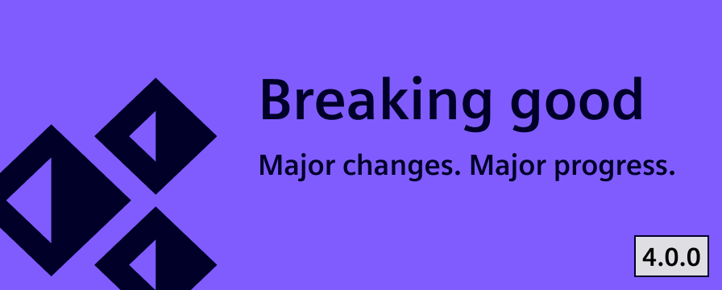

# Release V4.0.0

The next chapter of the Industrial Experience Design System is here. With this release we take a significant stept toward a shared design language across the organization. This version brings together thoughtful feature enhancements and essential style refinements, offering greater flexibility while reinforcing design consistency.

<!-- truncate -->

# How to start?

- Install `@siemens/ix` (`@siemens/ix-angular`, `@siemens/ix-react`, `@siemens/ix-vue`) via the `latest` tag
- Review detailed changelog here TBD LINK
- Make sure you're using the latest published version of our Figma library

# Button update

The time of confusing button variants is officially behind us. With this release, we’ve introduced a clear and intuitive naming convention: primary, secondary, and tertiary buttons. Now labeled exactly as such. This change improves clarity, making it easier to choose the right button for the right context.

To implement this improvement, we had to introduce a breaking change. Existing variant names will need to be updated manually. Please refer to our migration guide (TBD LINK) for detailed instructions.

In line with brand consistency efforts, all buttons now feature slightly rounded corners, offering a more modern and approachable look. Additionally, we’ve added support for placing icons to the right of the label. Especially useful for “Next” actions, where a left-aligned arrow often felt visually off.

# New app header options

The app header is now more flexible before. With the introduction of an additional secondary slot, teams can tailor the header to better fit their application needs.

We’ve also updated the documentation to showcase all available configuration options, including:

- Displaying a user avatar
- Using a secondary slot
- Enabling the borderless variant
- Showing an app icon
- Adding a sub-label to the app name

These enhancements come as additions to the existing header component, giving teams more options without disrupting current implementation.

# Elevation

Elevation helps create depth in the user interface. A simple elevation principle makes it easier for users to understand which elements sit above others, improving both hierarchy and interactivity.

With this major release, we are reducing the use of semi-transparent colors in favor of solid tones. This change improves visual separation between layers and aligns with our goal of a consistent design language.

The new colors are applied automatically when migrating to this version. Therefore, we recommend teams visually review their interfaces. To support this, our migration guide includes an overview where switching to outline variants are needed for good layer separation.

# Angular 20

This release brings full compatibility with Angular 20, helping teams keep their projects aligned with the latest framework improvements.

To reflect this, the peer dependencies have been updated to Angular version 20. Projects using this package will need to upgrade to Angular 20 before migrating to the latest version of iX. See more in the migration guide.

# AG Grid update

We are now publishing a separate Figma library using the official AG Grid design system styled with the iX theme. This gives designers direct access to AG Grid’s native components and layout logic. Developers benefit from AG Grid’s new theming API, which makes styling grids easier and more flexible. Together, this change makes design and development faster, clearer, and better aligned.

Please reach out to us at [team.ix.industry@siemens.com](mailto:team.ix.industry@siemens.com) and tell us about your migration experience.
If you encounter any issues, we are here to support you every step of the way.

We greatly appreciate your contributions.
