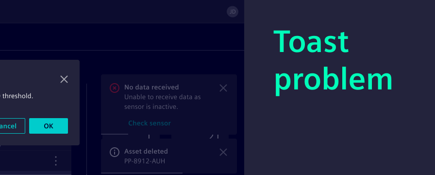
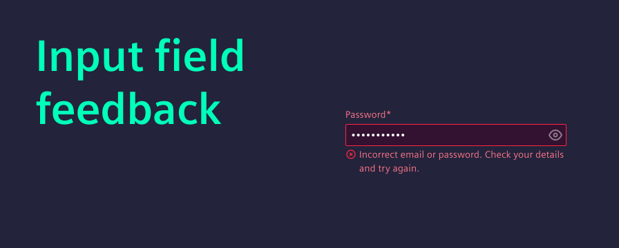
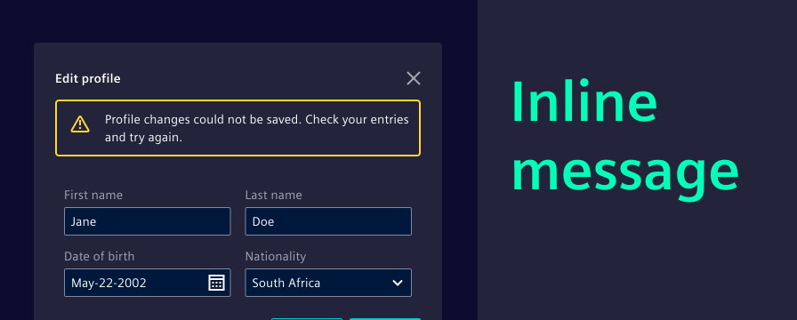
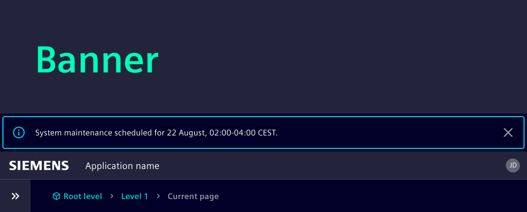
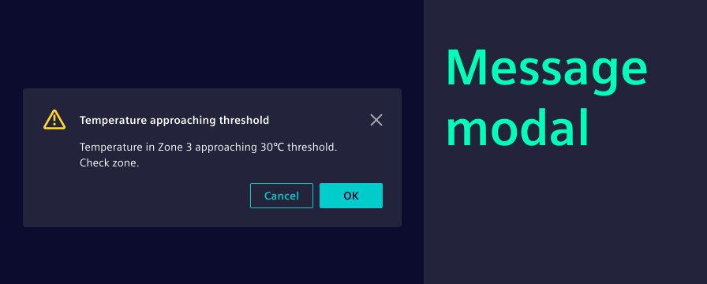
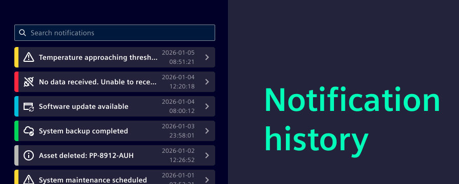

# Beyond the toast: Mastering messaging and feedback

Effective communication with users is of the highest priority. Providing timely, clear, and contextual feedback within our applications is crucial for a smooth and intuitive user experience. While toast messages have their place, relying on them exclusively can sometimes lead to missed information or user frustration.

In response to your questions about toast messages, and especially their interplay with modal dialogs, we want to guide you through our recommended best practices for displaying messages.

<!-- truncate -->

# The problem with over-toasting

[Toast](/docs/components/toast/guide) notifications are quick, non-intrusive pop-ups that provide simple feedback on a process. They are excellent for immediate low-priority confirmations, e.g. a successful deletion.

However, toasts can often be:

- Missed: Especially if a modal dialog is open or if the user’s attention is elsewhere.
- Disruptive: While generally non-blocking, a rapid succession of toasts can be overwhelming.
- Lacking context: Toasts are designed for brevity, making it challenging to convey detailed information.

This is why, for most scenarios requiring user attention or detailed information, we recommend exploring more robust messaging patterns.

# When to use what

We already offer a set of components designed to handle various messaging needs. Let's explore the alternatives to toast messages and understand when to use each one from contextual feedback to required decision making.

### Input field feedback texts: Immediate, contextual validation

<strong>When to use it:</strong> For immediate and highly contextual feedback related to user [input fields](/docs/components/forms-validation/guide), direct feedback texts are the recommended choice. These messages appear below the input field.

<strong>Why it's better than a toast:</strong> Input field feedback is directly tied to the user's action. It helps users correct errors and prevents frustration. A toast would be too far removed from the input field to be effective here.

Examples:

- "Invalid email format."
- "Password too short (minimum 8 characters)."
- "Required field."

### Inline notification: Feedback within components (planned)

<strong>When to use it:</strong> Inline notifications appear within a specific section or component of a page, rather than spanning the entire width. We are planning on providing a component that is optimized for inline use in future.

<strong>Why it's better than a toast:</strong> An inline notification provides contextual feedback directly where it's most relevant, without disrupting the overall page flow. It's less intrusive than a full banner but more persistent and noticeable than a toast for localized issues, especially when other UI elements (like modals) are present.

Examples:

- Above a form, indicating validation errors for multiple fields.
- Within a data table, showing a message about filtering results.
- Inside a specific widget, providing status updates.

### Banner: For persistent, system-wide or page-specific messages

<strong>When to use it:</strong> [Message bars](/docs/components/messagebar/code) (often referred to as banners) are ideal for important, non-blocking messages that need to persist until dismissed or resolved. These messages can be system-wide (affecting the entire application) or page-specific (relevant to a particular view). See our UX writing section on [non-critical information and time-related messages](/docs/guidelines/language/writing-style-guide-getting-started).

<strong>Why it's better than a toast:</strong> Unlike toasts, banners remain visible until the user takes action or the condition is resolved. This persistence ensures that important information, like a lost connection or planned maintenance, is not missed.

Examples:

- "Connection lost. Reconnecting..."
- "System maintenance scheduled for August 22nd, 02:00-04:00 CEST."
- "Your trial period ends in 7 days."

### Modal: For critical information and required interaction

<strong>When to use it:</strong> [Message modals](/docs/components/message-modal/guide) are your choice for critical information that demands immediate user attention and interaction. Think of scenarios where a user needs to confirm an action, acknowledge a severe error that blocks further progress, or make a crucial decision. See our UX writing section on [error and warning messages](/docs/guidelines/language/writing-style-guide-getting-started).

<strong>Why it's better than a toast:</strong> Modals overlay the entire application, ensuring the user's focus is entirely on the message. They prevent further interaction with the underlying content until dismissed, guaranteeing that critical information is seen and acted upon.

Examples:

- Confirming a permanent deletion.
- Alerting the user to a unsaved changes before navigating away.
- Displaying a critical system error that requires immediate resolution.

### Notification management: Persistent record of events

Users might miss a critical message or need to refer back to past notifications. A dedicated notification management provides a persistent record of important events and messages.

<strong>When to use it:</strong> This is particularly valuable for applications where:

- Users need to see a log of system actions or changes.
- Users need to catch up: After being away from the application, users can quickly review what they missed.
- Complex workflows: Where multiple actions trigger various messages.

<strong>How it adds value:</strong> A notification management is often presented as an [event list](/docs/components/event-list/code) on a separate page, within a dedicated dialog, or accessible via a notification icon. It ensures that no critical information is permanently lost. It complements all other messaging patterns by offering a centralized archive, allowing users to review, filter, and act upon past notifications. This significantly enhances user control and confidence in the application.

## Key takeaways for effective messaging

- <strong>Prioritize clarity and context:</strong> Always choose the messaging pattern that best communicates the information clearly and in the most relevant context.
- <strong>Reserve toasts for small feedback:</strong> Use toasts for quick, non-critical confirmations that don't require immediate user action or detailed explanation.
- <strong>Embrace alternatives:</strong> Leverage input field feedback for direct validation, inline notifications for contextual feedback, banners for persistent alerts, and modals for critical interactions.
- <strong>Provide a notification management:</strong> For important events and messages, offer a persistent record that users can access and review.
- <strong>Stay aligned:</strong> You can always refer to our component usage guides for the most up-to-date guidance and examples.

## More on messaging

- We highly recommend the [UX writing](/docs/guidelines/language/writing-style-guide-getting-started) chapter on how to effectively phrase your messages depending on the context, e.g. warning messages.
- The <strong>UX Design Pattern</strong> team is currently working on a detailed overview of messaging patterns. Follow them on [Viva Engage](https://engage.cloud.microsoft/main/org/siemens.com/groups/eyJfdHlwZSI6Ikdyb3VwIiwiaWQiOiIyMzcxMzg0NTI0ODAifQ/new) to stay tuned.