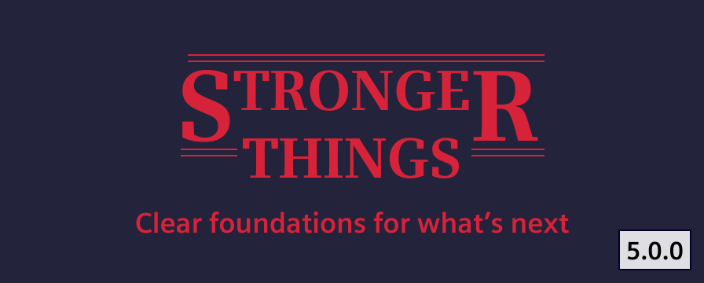
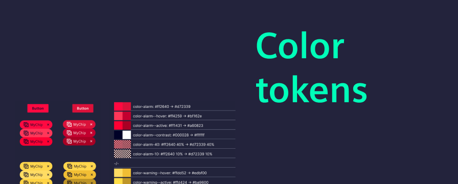
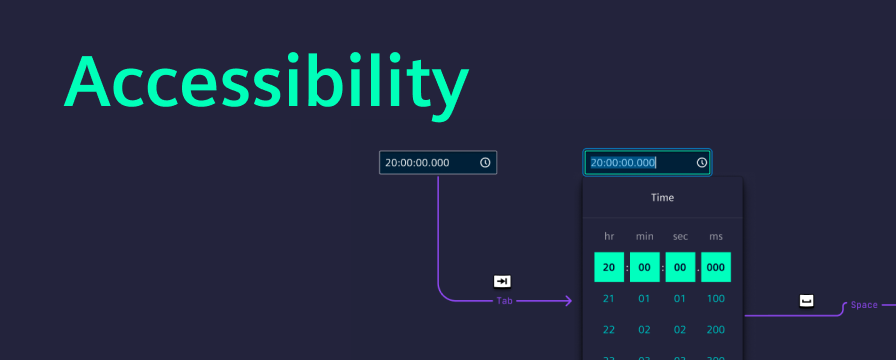
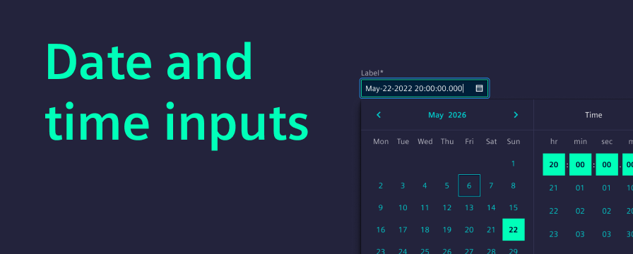
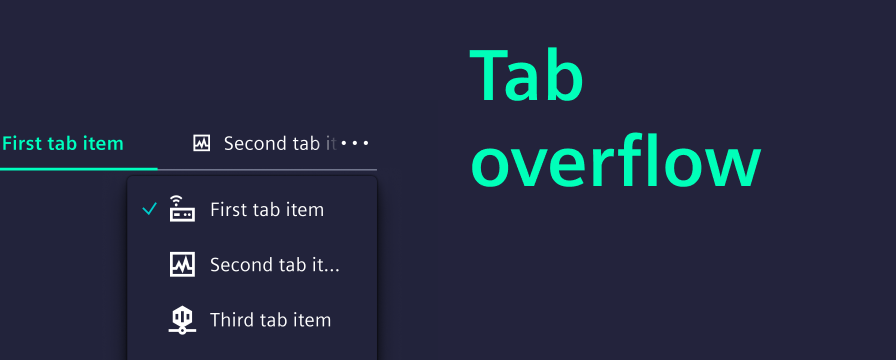
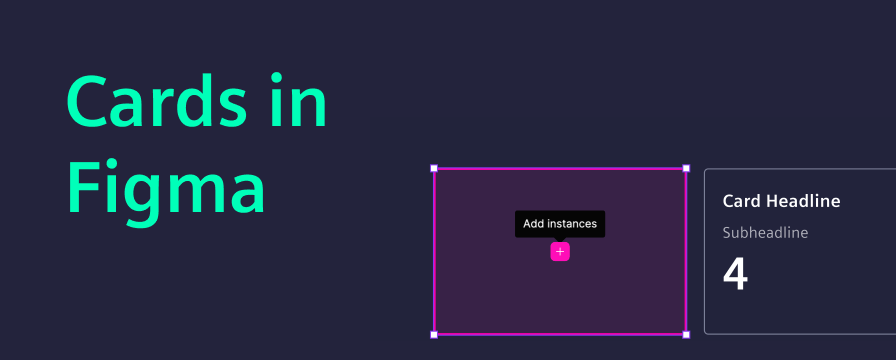

# Release V5.0.0

Version 5 marks a step forward for the Industrial Experience Design System. This major release focuses on improving accessibility, removing outdated components and strengthening the connection between design tokens, Figma, and code.

<!-- truncate -->

If you are planning an upgrade to Version 5, start here:

- Review the [migration guide](/docs/home/migration/5_0_0) for breaking changes and required updates.
- Expect the biggest impact in accessibility behavior, date and time inputs and token structure.
- Update both code and Figma assets if your team relies on shared component libraries.

# Why upgrade to Version 5?

With Version 5, we took the opportunity of a major release to address topics that require breaking changes, areas where incremental updates were no longer enough.

Our goals were clear:

- Reduce legacy APIs and outdated approaches.
- Align components with modern web and accessibility standards.
- Strengthen the connection between design tokens, Figma, and code.

# Color tokens now follow a shared reference model

The token structure is now aligned with the Siemens Design Language and built on strict reference tokens.

Teams now have a more consistent foundation across design systems and codebases.

- Color tokens are now strictly reference-based.
- Background, text, and accent tokens follow a clear hierarchy.
- Token naming is aligned to support shared reference tokens across Siemens design systems.
- Interaction colors allow distinctive interaction states for keyboard interactions.

# Accessibility improvements for keyboard navigation

Keyboard navigation and focus handling have been improved across several complex components.

The update focused especially on interaction clarity in areas such as:

- [Dropdowns](/docs/components/dropdown)
- Menus
- [Tabs](/docs/components/tabs)
- Composite form elements

# Date and time inputs are more capable

Version 5 adds new date and time input capabilities and improves consistency across existing flows, including:

- A new [date-time input](/docs/components/input-date-time)
- A dedicated [range field](/docs/components/range-field) concept
- Improved interaction consistency across [date pickers](/docs/components/date-picker)

Benefits include:

- More predictable date and time entry in data-heavy workflows
- More consistent behavior across locales and picker interactions
- Easier integration with [forms](/docs/components/forms-field) and validation logic

It also simplifies future extensions by reducing architectural complexity in the underlying implementation.

# Tabs now handle overflow with a More menu

[Tabs](/docs/components/tabs) now handle overflow more reliably in responsive layouts.

- Tab overflow is handled more intelligently.
- A “More menu” keeps all tabs accessible, regardless of viewport size.
- Visual styling is aligned with updated layout conventions.
- A continuous border helps separate the content below the tabs.
- Updated visuals make the selected tab more distinctive.

# Card components now use Figma native slots

The [card](/docs/components/card) updates in Version 5 are focused on the Figma library and are not related to code changes. Native Figma slots make card composition more flexible and support more responsive behavior directly in the library.

That change required a breaking update in the Figma library:

- Older versions of card components are now deprecated.
- Reworked card components are now provided under the same existing names.

Additional improvements include:

- A new property for switching between outline and filled variants.
- An example showing slot usage for responsive card behavior.

# More improvements in Version 5

Beyond the bigger themes, Version 5 also includes:

- Non-blocking [modal](/docs/components/modal) behavior improvements
- Architectural refactoring under the hood
- Bug fixes and performance improvements
- Updated component specifications in Figma

Together, these updates improve stability, consistency and future development speed even when they are less visible at first glance.
