import React from "react";
import { IxIcon } from "@siemens/ix-react";
import { iconAddCircleFilled } from "@siemens/ix-icons/icons";

# How to use slots in iX



Slots are one of the most useful composition patterns in iX. They let you place custom content in predefined areas of a component without rebuilding the component itself.

In this post, we explain what slots are, when to use them and how development and design teams can work with slots in a shared, consistent way.
<!-- truncate -->

Think of it like this:

- The component defines the structure and behavior.
- The slot defines where additional content can be placed.
- You provide the content that belongs to that position.

This keeps components reusable while still allowing flexible layouts:
- [Get started in development](#use-slots-in-development)
- [Get started in Figma](#use-slots-in-figma)

Typical slot usage in iX:

- Input fields with start and end content
- Headers with additional status or actions
- Layout components with positional areas (top, right, bottom, left)
- Figma components with native slot-based composition

## Use slots in development

### Example patterns

#### 1. Add start and end content to an input

```html
<ix-input label="Search">
  <ix-icon slot="start" name="search" size="16" aria-label="Search"></ix-icon>
  <ix-typography slot="end">Ctrl + K</ix-typography>
</ix-input>
```

Use this for compact, contextual information. Keep slot content short and scannable.

#### 2. Compose pane layouts by position

```html
<ix-pane-layout>
  <ix-pane heading="Details" slot="right" size="33%"></ix-pane>
  <ix-pane heading="Filters" slot="left" size="25%"></ix-pane>
</ix-pane-layout>
```

Use positional slots to express page structure directly and keep layout intent readable.

### Dos and Don’ts

<div className="dos-and-donts" markdown="true">
<div className="dos" markdown="true">

- Do use only documented slot names of components
- Do keep slot content lightweight and purpose-specific
- Do consider smaller breakpoints, interaction via keyboard and touch, and screen reader behavior

</div>
<div className="donts" markdown="true">

- Don’t use slots as a workaround for missing component behavior
- Don’t mix unrelated content into a slot just because space is available
- Don’t replace primary content hierarchy with slot content

</div>
</div>

## Use slots in Figma

Version 5 introduced native slot-based composition for key components such as card and tabs in the iX Figma library. It is now possible to add content directly into slots in Figma, instead of detaching your instances, or creating custom content components.



When you select an instance, Figma shows a pink border around the slot area which helps identifying where content can be inserted.

You can add any content to a slot, e.g. by clicking on the <IxIcon name={iconAddCircleFilled} size={16}></IxIcon> ("Add instance") or creating new layers directly in the slot.

If preferred instances are configured for a slot, the Add instances popup suggests specific components recommended by iX. For example, dropdown items are suggested for dropdowns by default.

For handoff quality, keep slot content concise, validate responsive behavior (especially truncation and overflow), and annotate special interaction intent when needed.

## Collaboration tips for design and development

- Use the same naming language for slot content in design specs and code reviews
- Document which content is required, optional or mutually exclusive
- Align early on responsive behavior for slot-heavy components
- Prefer one clear composition pattern over many one-off exceptions

### When not to use slots

Do not use slots to solve every customization request.

Instead, consider:

- A different iX component that already matches the use case
- A layout-level composition change
- A design decision to simplify content hierarchy

Slots are most effective when they enhance clarity, not when they increase complexity.

### Key takeaway

Slots are a shared design and development pattern:

- Developers get flexible composition without losing component quality.
- Designers get adaptable component structures without exploding variants.
- Teams get better consistency from Figma to implementation.

When used intentionally, slots help iX applications stay scalable, maintainable and clear.
