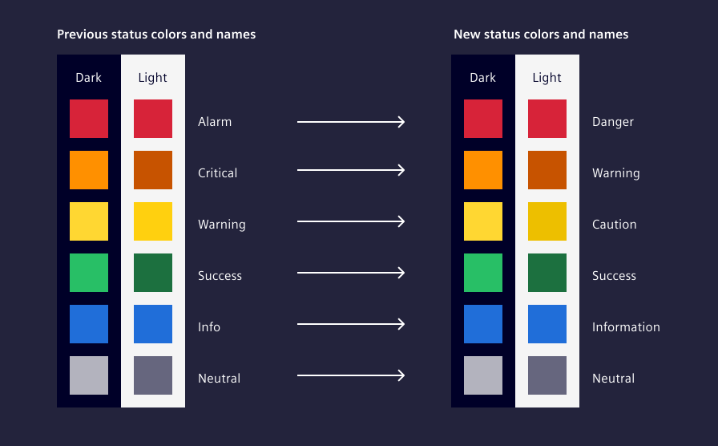

import React from "react";
import { IxIcon } from "@siemens/ix-react";
import { iconAddCircleFilled } from "@siemens/ix-icons/icons";

# Status color update

With the upcoming version 6 release we are updating and refining our status and risk level terminology to align with international standards and improve accessibility. In this post, we explain what will change and why.
<!-- truncate -->

## Update of status names

We are refining our status color names to align with a unified color token set that will be part of our next major release. The table below shows how each status name is being updated:

| Previous | New |
|----------|-----|
| Alarm (Red) | Danger (Red) |
| Critical (Orange) | Warning (Orange) |
| Warning (Yellow) | Caution (Yellow) |
| Success (Green) | Success (Green) |
| Info (Blue) | Information (Blue) |
| Neutral (Gray) | Neutral (Gray) |

### Why we're making this change

**Align with ISO standards:** ISO 3864 and ISO 7010 provide guidance on risk levels and their associated colors. Although these standards were created for machine and consumer product labeling, their concepts are closely related and can be applied to software user interfaces as well.

ISO 3864-2 defines:
- Danger as red
- Warning as orange
- Caution as yellow

ISO 7010 additionally uses:
- Green for safe conditions
- Blue for mandatory information

**Comply with web accessibility guidelines (WCAG):** Orange as new system feedback color for Warning also improves compliance with WCAG contrast requirements, particularly in light mode.

## A new status level above danger

We are introducing the **new status color purple** in iX version 6.

Use purple for:
- Events that are more severe than danger (red).
- Rare, critical situations, e.g. a threat to safety, operations, or critical infrastructure.
- Events at a level higher than a normal danger alert.

Do not use purple for:
- Another way to show a normal danger alert.

### Why we're making this change

ISO 3864-2 defines risk levels from least to most severe: 
Caution (yellow) → Warning (orange) → Danger (red)

A level beyond Danger is not defined by the ISO standards even though other domains, such as environmental safety and cybersecurity, use additional risk levels beyond red.

As it is already widely used for this severity, the term "Critical" will be used from iX version 6 for this level.

The color purple is used for Critical to continue the color spectrum and to provide enough contrast in both light and dark mode.

## Way forward

We know that these changes have effects on your project. We are reaching out early to show what you can expect. With the release we will provide migration documentation in the breaking changes guide. If you have any questions do not hesitate to reach out via our [support channels](https://ix.siemens.io/docs/home/support/contact-us).
