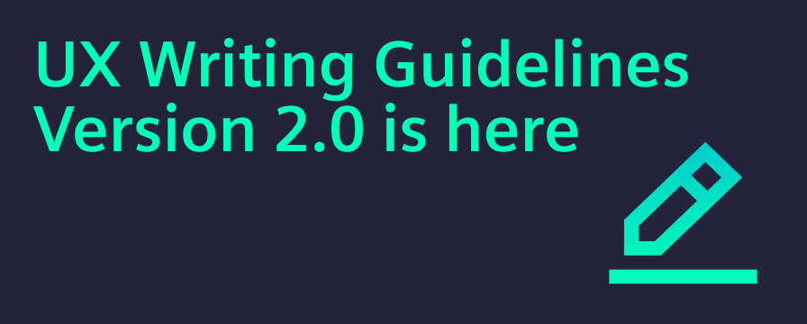
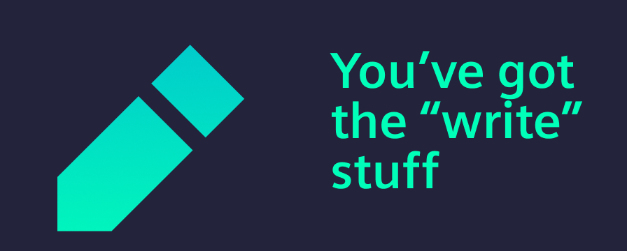

---
authors:
  - name: Zsuzsanna Racz
tags:
  - UX writing
---

# Announcing UX Writing Guidelines 2.0

We are thrilled to share that UXW Version 2.0 is officially here!

Following the launch of our initial version, we gathered a wealth of insights and feedback from teams across our entire organization. It quickly became clear: to truly support the diverse needs of global product teams creating industrial applications, we needed to think bigger.

<!-- truncate -->

## Why is it 3x bigger?

You’ll notice that Version 2.0 is more than three times the size of the original guide. This isn’t just about “more words”; it’s about providing more value. We expanded the guide for two key reasons:

### Broader and deeper content

We’ve introduced a wide range of new topics and provided much deeper technical detail on existing guidelines to answer the questions we hear most often.

### Accessibility and clarity

Inclusivity is at our core. We’ve redesigned our guidelines to be navigated easily by everyone (even AI agents), with a specific focus on supporting non-native English speakers. By providing more context and clearer “Dos and Don’ts” examples, we hope our guidelines are accessible to all.

## Get involved

This release was made possible by the dedicated effort of our cross-functional contributors, including our design system partners, accessibility specialists, and meticulous editorial team. Thank you for helping us build a better voice for our users. 

Explore the new guidelines and integrate them into your workflow, starting here: [UXW Writing Getting Started](/docs/guidelines/language/writing-style-guide-getting-started) and if you have any questions or a contribution, do not hesitate to reach out via our [support channels](/docs/home/support/contact-us).
